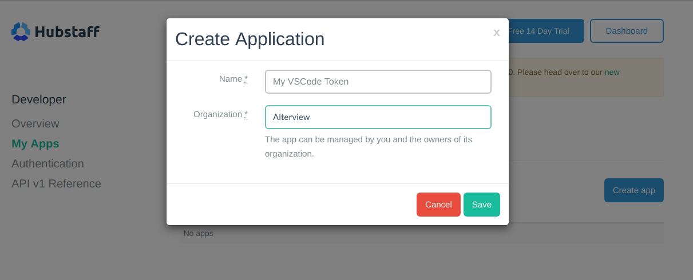

# Hubstaff for VSCode
<p align="center">
    <a href="https://marketplace.visualstudio.com/items?itemName=mehrad.hubstaff" title="Hubstaff">
        
    </a>
</p>

<center>
    
[](https://marketplace.visualstudio.com/items?itemName=mehrad.hubstaff)
[](https://marketplace.visualstudio.com/items?itemName=mehrad.hubstaff)
[](https://marketplace.visualstudio.com/items?itemName=mehrad.hubstaff#review-details)


See your worked hours in VSCode status bar. Powerd by **[Hubstaff API](https://app.hubstaff.com/developer/docs/api/v1)**.

*Contributions and bug reports are welcome.*

</center>

## Installing

Launch VS Code Quick Open (`Ctrl + P`), paste the following command, and press enter:

```bash
ext install hubstaff
```

Or search for [`kutt`](https://marketplace.visualstudio.com/items?itemName=mehrad.hubstaff) in your editor.

## How to use?

 1. Create an [app on your Hubstaff account](https://app.hubstaff.com/developer/my_apps).
 
 1. Copy your `App token`.
 1. Return to VSCode and press `Ctrl + Shift + P`, then type `hubstaff` and chose `Set Hubstaff App token`.
 1. paste your `App token`.
 1. Done! now you got your time for today in Status Bar,

## Extension Settings

// TODO

## Release Notes

###0.0.2

- Initial release. It now works.


## Contributors <3

If you can make a contribution to this project, **that's one small step for you but one giant leap for mankind.**

## Disclimer
This extention is free and open sourse and has no realtion to Netsoft Holdings, LLC (Hubstaff company).
